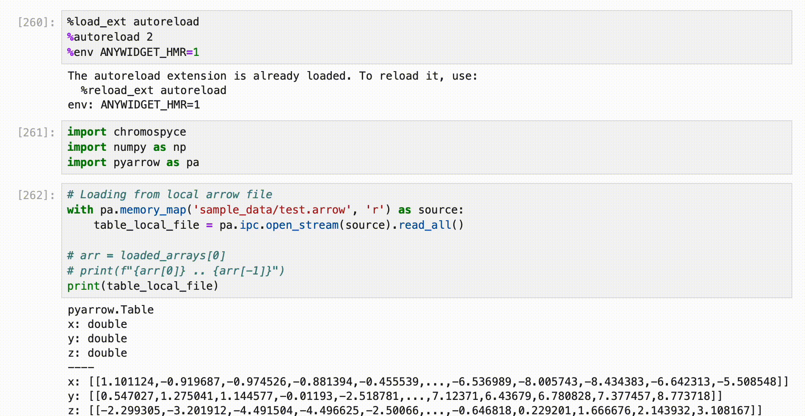

# chromospyce

This is an [anywidget](https://github.com/manzt/anywidget)-powered version of
the [chromospace](https://github.com/dvdkouril/chromospace) library intended
for use in computational notebooks, such as Jupyter Notebook.



## Basic usage
The available functionality is pretty limited at this moment. We will stabilize the API as we go. At this point, you can display 3D chromatin models.

```python
import random
import chromospyce
import numpy as np
import pyarrow as pa

BINS_NUM = 1000

def make_random_3D_chromatin_structure(n):
    position = np.array([0.0, 0.0, 0.0])
    positions = [position.copy()]
    x_arr = []
    y_arr = []
    z_arr = []
    for _ in range(n):
        step = np.random.choice([-1.0, 0.0, 1.0], size=3)  # Randomly choose to move left, right, up, down, forward, or backward
        position += step
        positions.append(position.copy())
        x_arr.append(position[0])
        y_arr.append(position[1])
        z_arr.append(position[2])
    return [x_arr, y_arr, z_arr]

# Step 1: Generate random structure and convert from arrays to 
#         Apache Arrow table with 3 columns: 'x', 'y', 'z'
random_structure = make_random_3D_chromatin_structure(BINS_NUM)
table = pa.Table.from_arrays(random_structure, names=["x", "y", "z"])

# Convert the Table to bytes
output_stream = pa.BufferOutputStream()
with pa.ipc.RecordBatchStreamWriter(output_stream, table.schema) as writer:
    writer.write_table(table)

table_bytes = output_stream.getvalue().to_pybytes()

# Step 2: Display the structure in a chromospyce widget
numbers = list(range(1, BINS_NUM+1))
vc = {
    "color": {
        "values": numbers,
        "min": 1,
        "max": BINS_NUM,
        "colorScale": "Spectral"
    }, 
    # "color": "#6600ff", # alternatively
    "scale": 0.01, 
    "links": True, 
    "mark": "sphere"
}
chromospyce.Widget(structure=table_bytes, viewconfig=vc)
```

This example is currently a bit verbose to showcase the code for converting
data from Python arrays to an Apache Arrow table. [Read more about why Apache
Arrow is the only format supported by
chromospace/chromospyce](https://github.com/dvdkouril/chromospace/tree/main/docs#data-loading).
